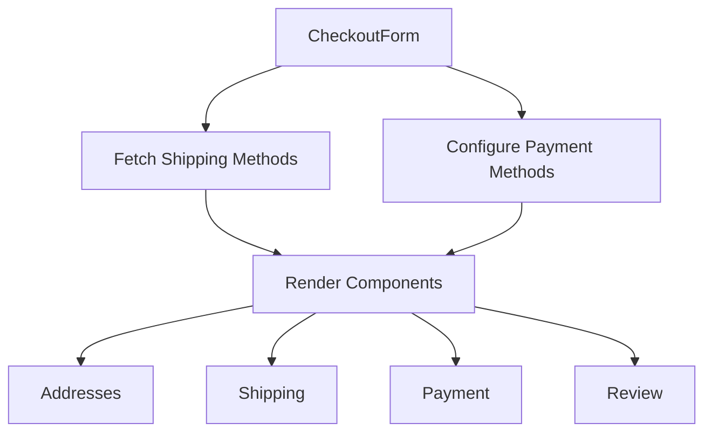

# Checkout Form 

An asynchronous server component that orchestrates the complete checkout process, managing shipping methods, payment options, and customer information.

## Props

| Prop | Type | Required | Description |
|------|------|----------|-------------|
| cart | HttpTypes.StoreCart \| null | Yes | The current cart object containing items and checkout information |
| customer | HttpTypes.StoreCustomer \| null | Yes | Customer information if available |

## Component Structure

The CheckoutForm coordinates four main checkout steps:

1. Address Collection (`Addresses`)
2. Shipping Method Selection (`Shipping`)
3. Payment Method Selection (`Payment`)
4. Order Review (`Review` - currently commented out)

## Usage

```tsx copy
import CheckoutForm from "./components/CheckoutForm"

const CheckoutPage = async () => {
  const cart = await fetchCart()
  const customer = await fetchCustomer()

  return (
    <div className="container">
      <CheckoutForm 
        cart={cart}
        customer={customer}
      />
    </div>
  )
}
```

## Data Fetching

The component fetches necessary data for the checkout process:

```typescript copy
// Fetch available shipping methods
const shippingMethods = await listCartShippingMethods(cart.id)

// Payment methods configuration
const paymentMethods = [
  { id: 'pp_stripe_stripe', is_enabled: true },
  { id: 'pp_system_default', is_enabled: true },
  { id: 'pp_zelle_default', is_enabled: true },
  { id: 'pp_crypto_default', is_enabled: true },
]
```

## Payment Methods

The component supports multiple payment providers:

- Stripe (`pp_stripe_stripe`)
- System Default (`pp_system_default`)
- Zelle (`pp_zelle_default`)
- Cryptocurrency (`pp_crypto_default`)

## Component Layout

Uses a responsive grid layout:

```tsx copy
<div className="w-full grid grid-cols-1 gap-y-8">
  <Addresses ... />
  <Shipping ... />
  <Payment ... />
  {/* <Review ... /> */}
</div>
```

## Sub-Components

### Addresses Component
Handles collection and validation of shipping and billing addresses:
```tsx copy
<Addresses 
  cart={cart} 
  customer={customer} 
/>
```

### Shipping Component
Manages shipping method selection:
```tsx copy
<Shipping 
  cart={cart} 
  availableShippingMethods={shippingMethods} 
/>
```

### Payment Component
Handles payment method selection and processing:
```tsx copy
<Payment 
  cart={cart} 
  availablePaymentMethods={paymentMethods} 
/>
```

### Review Component (Optional)
Final order review step (currently disabled):
```tsx copy
{/* <Review cart={cart} /> */}
```

## Error Handling

The component implements basic error handling:

- Returns null if cart is not available
- Returns null if shipping or payment methods cannot be fetched
- Sub-components handle their own error states

## Dependencies

### External Libraries
- `@medusajs/types`: For type definitions
- Data fetching utilities from `@lib/data`

### Internal Components
- `@modules/checkout/components/addresses`
- `@modules/checkout/components/payment`
- `@modules/checkout/components/review`
- `@modules/checkout/components/shipping`

## Best Practices

1. Validate cart existence before processing
2. Ensure all required methods are available
3. Handle loading and error states appropriately
4. Maintain proper order of checkout steps
5. Provide clear feedback for each step
6. Implement proper type checking

## Data Flow



## Technical Considerations

### Server Component
- Uses the `async` keyword for server-side rendering
- Handles data fetching before component render
- Provides data to client-side sub-components

### Performance
- Minimizes client-side data fetching
- Loads payment methods configuration statically
- Implements null checks for efficient rendering

### Type Safety
- Uses Medusa HTTP types for proper type checking
- Implements null checks for optional props
- Ensures type safety in sub-component props

## Testing Considerations

Key areas to test:
1. Cart validation
2. Shipping method availability
3. Payment method configuration
4. Component rendering with various prop combinations
5. Error state handling
6. Data fetching failures
7. Sub-component integration

## Customization

The component can be customized by:
1. Modifying the payment methods array
2. Adjusting the grid layout classes
3. Enabling/disabling the Review step
4. Adding additional checkout steps
5. Modifying the data fetching logic

## Future Improvements

Potential enhancements:
1. Re-enable Review step with proper integration
2. Add progress indicator for checkout steps
3. Implement better error handling and recovery
4. Add loading states for data fetching
5. Enhance type safety with stricter types